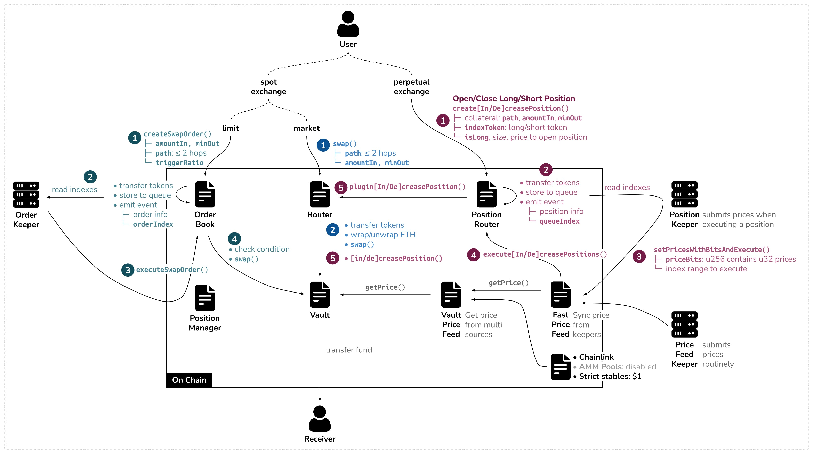

# GMX Contracts Insights

Based on commit f172642d.

Resources that may help to understand:
- https://liamhieuvu.com/how-gmx-limit-order-and-long-short-work
- https://github.com/Dapp-Learning-DAO/Dapp-Learning/tree/main/defi/GMX
- https://radial-calcium-3ec.notion.site/GMX-5d273a72baee419a8e7a7afe8570b48c

The architecture diagram from the first article is pretty clear:

